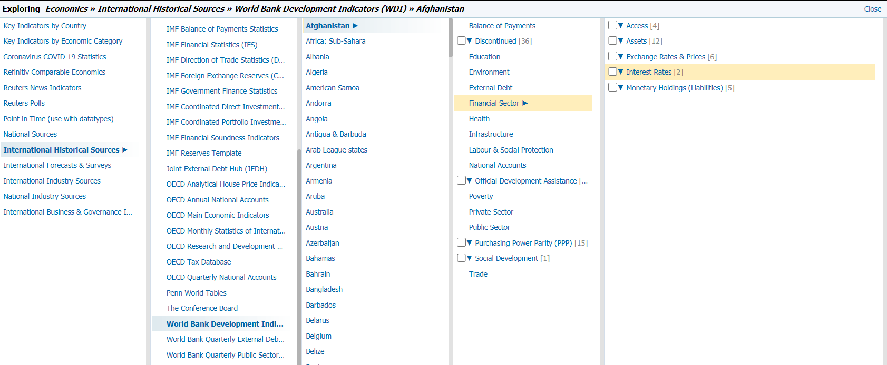
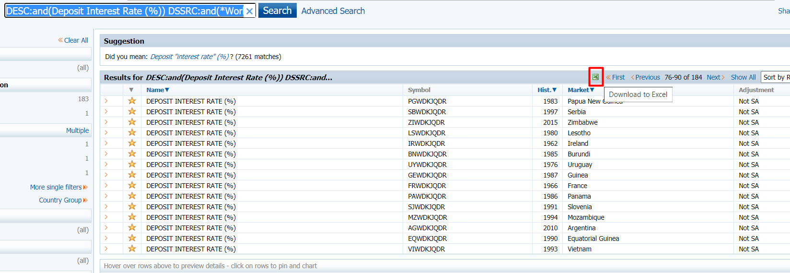
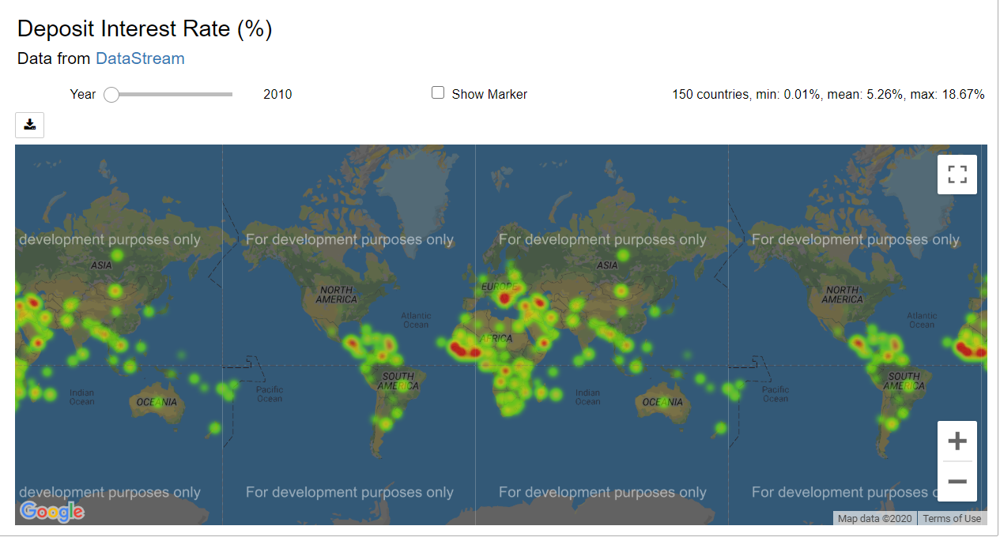
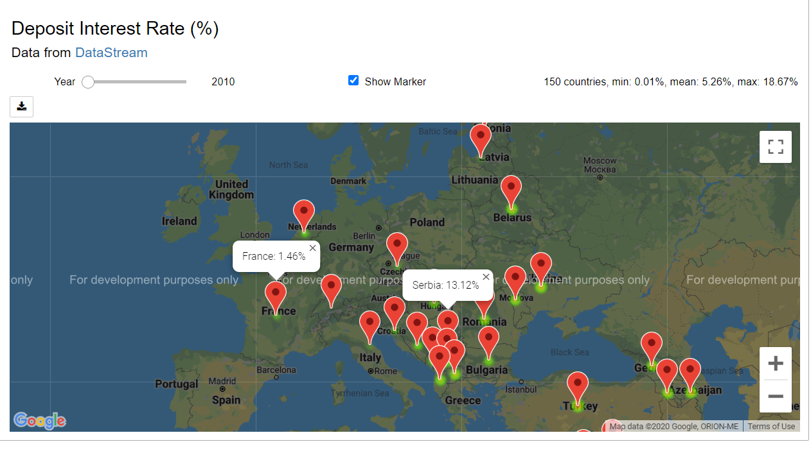

# Creating a WDI Heatmap with DataStream Web Services and Google Maps

This example demonstrates how to retrieve World Development Indicators from DataStream Web Services and then use Google Maps (**gmaps**) to create a heatmap with the retrieved data. To run the example, the DataStream account and Google Maps' API key are required. To use other maps, such as **Geopandas**, please refer to [this article](https://developers.refinitiv.com/article/using-datastream-generate-coronavirus-cumulative-cases-geographical-map). 

To get the  Google Maps' API key, please refer to [Get an API Key](https://developers.google.com/maps/documentation/embed/get-api-key).

This example creates a heatmap of the yearly **deposit interest rate (%)** across countries. However, it can be applied to any World Development Indicators. 

## Loading required packages

The required packages for this example are:

- **DataStreamDSWS**: Python API package for Refinitiv Datastream Webservice
- **pandas**: Powerful data structures for data analysis, time series, and statistics
- **numpy**: NumPy is the fundamental package for array computing with Python
- **gmaps**: Google maps plugin for Jupyter notebooks
- **IPython.display**: Public API for display tools in IPython
- **ipywidgets**: IPython HTML widgets for Jupyter

You also need to install **lxml** package (**pip install lxml**) used by pandas when parsing the HTML file.


```python
import DatastreamDSWS as DSWS
import pandas as pd
import numpy as np
import gmaps
from IPython.display import display
import ipywidgets as widgets
```

## Setting credentials

The DataStream account and Google Maps' API key are required to run the example. 


```python
ds = DSWS.Datastream(username = '<username>', password = '<password>')
gmaps.configure(api_key='<api_key>')
```

## Loading an instrument list
In DataStream, the World Development Indicators are available under the **Economics » International Historical Sources » World Bank Development Indicators (WDI)** category. The data is categorized by countries.


You can use the indication name to search for instruments of all available countries, and then refine the search results by selecting the results from  World Bank WDI. For example, the search query for Deposit Interest Rate (%) from World Bank WDI is **"DESC:and(Deposit Interest Rate (%)) DSSRC:and(*World Bank WDI*)"**. 



After that, the search results can be downloaded to an excel file. This excel file can be read into a data frame object by calling the **pandas.read_html** method. Then, only active instruments are selected. In the data frame , the **Symbol** column contains instrument names and the **Market** column contains country names.


```python
df = pd.read_html('DepositeInterestRate.xls')  
df[0] = df[0][df[0].Activity=="Active"]
df[0]
```


<div>
<table border="1" class="dataframe">
  <thead>
    <tr style="text-align: right;">
      <th></th>
      <th>Name</th>
      <th>Symbol</th>
      <th>RIC</th>
      <th>Start Date</th>
      <th>End Date</th>
      <th>Hist.</th>
      <th>Category</th>
      <th>Market</th>
      <th>Source</th>
      <th>Frequency</th>
      <th>Adjustment</th>
      <th>Forecast</th>
      <th>Full Name</th>
      <th>Activity</th>
    </tr>
  </thead>
  <tbody>
    <tr>
      <th>0</th>
      <td>DEPOSIT INTEREST RATE (%)</td>
      <td>NGWDKJQDR</td>
      <td>-</td>
      <td>1/1/1970</td>
      <td>12/31/2019</td>
      <td>1970</td>
      <td>Economics</td>
      <td>Nigeria</td>
      <td>World Bank WDI</td>
      <td>Annual</td>
      <td>Not seasonally adjusted</td>
      <td>Historical</td>
      <td>Nigeria, Interest Rates, Deposit Interest Rate...</td>
      <td>Active</td>
    </tr>
    <tr>
      <th>1</th>
      <td>DEPOSIT INTEREST RATE (%)</td>
      <td>BLWDKJQDR</td>
      <td>-</td>
      <td>1/1/2000</td>
      <td>12/31/2019</td>
      <td>2000</td>
      <td>Economics</td>
      <td>Bulgaria</td>
      <td>World Bank WDI</td>
      <td>Annual</td>
      <td>Not seasonally adjusted</td>
      <td>Historical</td>
      <td>Bulgaria, Interest Rates, Deposit Interest Rat...</td>
      <td>Active</td>
    </tr>
    <tr>
      <th>2</th>
      <td>DEPOSIT INTEREST RATE (%)</td>
      <td>MYWDKJQDR</td>
      <td>-</td>
      <td>1/1/1966</td>
      <td>12/31/2019</td>
      <td>1966</td>
      <td>Economics</td>
      <td>Malaysia</td>
      <td>World Bank WDI</td>
      <td>Annual</td>
      <td>Not seasonally adjusted</td>
      <td>Historical</td>
      <td>Malaysia, Interest Rates, Deposit Interest Rat...</td>
      <td>Active</td>
    </tr>
    <tr>
      <th>3</th>
      <td>DEPOSIT INTEREST RATE (%)</td>
      <td>NZWDKJQDR</td>
      <td>-</td>
      <td>1/1/1990</td>
      <td>12/31/2019</td>
      <td>1990</td>
      <td>Economics</td>
      <td>New Zealand</td>
      <td>World Bank WDI</td>
      <td>Annual</td>
      <td>Not seasonally adjusted</td>
      <td>Historical</td>
      <td>New Zealand, Interest Rates, Deposit Interest ...</td>
      <td>Active</td>
    </tr>
    <tr>
      <th>4</th>
      <td>DEPOSIT INTEREST RATE (%)</td>
      <td>SPWDKJQDR</td>
      <td>-</td>
      <td>1/1/1977</td>
      <td>12/31/2019</td>
      <td>1977</td>
      <td>Economics</td>
      <td>Singapore</td>
      <td>World Bank WDI</td>
      <td>Annual</td>
      <td>Not seasonally adjusted</td>
      <td>Historical</td>
      <td>Singapore, Interest Rates, Deposit Interest Ra...</td>
      <td>Active</td>
    </tr>
    <tr>
      <th>...</th>
      <td>...</td>
      <td>...</td>
      <td>...</td>
      <td>...</td>
      <td>...</td>
      <td>...</td>
      <td>...</td>
      <td>...</td>
      <td>...</td>
      <td>...</td>
      <td>...</td>
      <td>...</td>
      <td>...</td>
      <td>...</td>
    </tr>
    <tr>
      <th>175</th>
      <td>DEPOSIT INTEREST RATE (%)</td>
      <td>IAWDKJQDR</td>
      <td>-</td>
      <td>1/1/2003</td>
      <td>12/31/2016</td>
      <td>2003</td>
      <td>Economics</td>
      <td>Iran</td>
      <td>World Bank WDI</td>
      <td>Annual</td>
      <td>Not seasonally adjusted</td>
      <td>Historical</td>
      <td>Iran, Islamic Republic of, Interest Rates, Dep...</td>
      <td>Active</td>
    </tr>
    <tr>
      <th>176</th>
      <td>DEPOSIT INTEREST RATE (%)</td>
      <td>UKWDKJQDR</td>
      <td>-</td>
      <td>1/1/1960</td>
      <td>12/31/1998</td>
      <td>1960</td>
      <td>Economics</td>
      <td>United Kingdom</td>
      <td>World Bank WDI</td>
      <td>Annual</td>
      <td>Not seasonally adjusted</td>
      <td>Historical</td>
      <td>United Kingdom, Interest Rates, Deposit Intere...</td>
      <td>Active</td>
    </tr>
    <tr>
      <th>177</th>
      <td>DEPOSIT INTEREST RATE (%)</td>
      <td>ICWDKJQDR</td>
      <td>-</td>
      <td>1/1/1973</td>
      <td>12/31/2004</td>
      <td>1973</td>
      <td>Economics</td>
      <td>Iceland</td>
      <td>World Bank WDI</td>
      <td>Annual</td>
      <td>Not seasonally adjusted</td>
      <td>Historical</td>
      <td>Iceland, Interest Rates, Deposit Interest Rate...</td>
      <td>Active</td>
    </tr>
    <tr>
      <th>178</th>
      <td>DEPOSIT INTEREST RATE (%)</td>
      <td>UAWDKJQDR</td>
      <td>-</td>
      <td>1/1/1980</td>
      <td>12/31/2001</td>
      <td>1980</td>
      <td>Economics</td>
      <td>United Arab Emirates</td>
      <td>World Bank WDI</td>
      <td>Annual</td>
      <td>Not seasonally adjusted</td>
      <td>Historical</td>
      <td>United Arab Emirates, Interest Rates, Deposit ...</td>
      <td>Active</td>
    </tr>
    <tr>
      <th>179</th>
      <td>DEPOSIT INTEREST RATE (%)</td>
      <td>LYWDKJQDR</td>
      <td>-</td>
      <td>1/1/1968</td>
      <td>12/31/2014</td>
      <td>1968</td>
      <td>Economics</td>
      <td>Libya</td>
      <td>World Bank WDI</td>
      <td>Annual</td>
      <td>Not seasonally adjusted</td>
      <td>Historical</td>
      <td>Libya, Interest Rates, Deposit Interest Rate (...</td>
      <td>Active</td>
    </tr>
  </tbody>
</table>
<p>180 rows × 14 columns</p>
</div>


## Requesting data

The instrument names in the Symbol column are split into several batch requests. Each batch request containing 20 instruments is sent to the DataStream Web Services to request yearly data for the last ten years. All results are joined to create a data frame object. Then, missing data is removed. 


```python
item_list=df[0]["Symbol"].values
batch_list = np.array_split(item_list,len(item_list)/20)
data = None
for batch in batch_list:
    temp_dat = ds.get_data(tickers=','.join(batch), start='-10Y',freq='Y')
    
    if  data is None:
        data = temp_dat
    else:
        data = data.join(temp_dat)
data.dropna(how='all', inplace=True)
data.dropna(axis=1,how='all',inplace=True)
data
```


<div>
<table border="1" class="dataframe">
  <thead>
    <tr>
      <th>Instrument</th>
      <th>NGWDKJQDR</th>
      <th>BLWDKJQDR</th>
      <th>MYWDKJQDR</th>
      <th>NZWDKJQDR</th>
      <th>SPWDKJQDR</th>
      <th>AOWDKJQDR</th>
      <th>TOWDKJQDR</th>
      <th>RSWDKJQDR</th>
      <th>BIWDKJQDR</th>
      <th>MCWDKJQDR</th>
      <th>...</th>
      <th>MDWDKJQDR</th>
      <th>USWDKJQDR</th>
      <th>BAWDKJQDR</th>
      <th>LVWDKJQDR</th>
      <th>YAWDKJQDR</th>
      <th>MIWDKJQDR</th>
      <th>EOWDKJQDR</th>
      <th>LAWDKJQDR</th>
      <th>IAWDKJQDR</th>
      <th>LYWDKJQDR</th>
    </tr>
    <tr>
      <th>Field</th>
      <th></th>
      <th></th>
      <th></th>
      <th></th>
      <th></th>
      <th></th>
      <th></th>
      <th></th>
      <th></th>
      <th></th>
      <th>...</th>
      <th></th>
      <th></th>
      <th></th>
      <th></th>
      <th></th>
      <th></th>
      <th></th>
      <th></th>
      <th></th>
      <th></th>
    </tr>
    <tr>
      <th>Dates</th>
      <th></th>
      <th></th>
      <th></th>
      <th></th>
      <th></th>
      <th></th>
      <th></th>
      <th></th>
      <th></th>
      <th></th>
      <th></th>
      <th></th>
      <th></th>
      <th></th>
      <th></th>
      <th></th>
      <th></th>
      <th></th>
      <th></th>
      <th></th>
      <th></th>
    </tr>
  </thead>
  <tbody>
    <tr>
      <th>2010-06-30</th>
      <td>6.52</td>
      <td>4.08</td>
      <td>2.50</td>
      <td>4.58</td>
      <td>0.21</td>
      <td>12.76</td>
      <td>8.39</td>
      <td>6.01</td>
      <td>0.47</td>
      <td>3.69</td>
      <td>...</td>
      <td>10.29</td>
      <td>0.31</td>
      <td>1.23</td>
      <td>0.77</td>
      <td>18.67</td>
      <td>3.60</td>
      <td>1.11</td>
      <td>3.0</td>
      <td>11.94</td>
      <td>2.5</td>
    </tr>
    <tr>
      <th>2011-06-30</th>
      <td>5.69</td>
      <td>3.37</td>
      <td>2.91</td>
      <td>4.27</td>
      <td>0.17</td>
      <td>6.31</td>
      <td>8.50</td>
      <td>4.44</td>
      <td>0.40</td>
      <td>3.76</td>
      <td>...</td>
      <td>10.65</td>
      <td>0.30</td>
      <td>1.02</td>
      <td>0.82</td>
      <td>20.00</td>
      <td>4.11</td>
      <td>1.27</td>
      <td>NaN</td>
      <td>11.16</td>
      <td>2.5</td>
    </tr>
    <tr>
      <th>2012-06-29</th>
      <td>8.41</td>
      <td>3.08</td>
      <td>2.98</td>
      <td>4.11</td>
      <td>0.14</td>
      <td>3.60</td>
      <td>7.99</td>
      <td>5.53</td>
      <td>0.23</td>
      <td>3.83</td>
      <td>...</td>
      <td>10.40</td>
      <td>0.28</td>
      <td>1.08</td>
      <td>0.38</td>
      <td>19.50</td>
      <td>11.08</td>
      <td>0.67</td>
      <td>NaN</td>
      <td>14.81</td>
      <td>2.5</td>
    </tr>
    <tr>
      <th>2013-06-28</th>
      <td>7.95</td>
      <td>2.41</td>
      <td>2.97</td>
      <td>3.83</td>
      <td>0.14</td>
      <td>3.15</td>
      <td>7.65</td>
      <td>5.59</td>
      <td>0.28</td>
      <td>3.91</td>
      <td>...</td>
      <td>10.15</td>
      <td>NaN</td>
      <td>1.06</td>
      <td>0.19</td>
      <td>15.25</td>
      <td>18.41</td>
      <td>0.42</td>
      <td>NaN</td>
      <td>14.76</td>
      <td>2.5</td>
    </tr>
    <tr>
      <th>2014-06-30</th>
      <td>9.34</td>
      <td>1.66</td>
      <td>3.05</td>
      <td>4.01</td>
      <td>0.14</td>
      <td>3.53</td>
      <td>7.26</td>
      <td>6.04</td>
      <td>0.30</td>
      <td>3.89</td>
      <td>...</td>
      <td>10.95</td>
      <td>NaN</td>
      <td>0.98</td>
      <td>NaN</td>
      <td>NaN</td>
      <td>13.17</td>
      <td>0.51</td>
      <td>NaN</td>
      <td>16.94</td>
      <td>2.5</td>
    </tr>
    <tr>
      <th>2015-06-30</th>
      <td>9.15</td>
      <td>0.61</td>
      <td>3.13</td>
      <td>3.73</td>
      <td>0.17</td>
      <td>3.31</td>
      <td>7.00</td>
      <td>9.20</td>
      <td>0.34</td>
      <td>3.80</td>
      <td>...</td>
      <td>14.67</td>
      <td>NaN</td>
      <td>0.99</td>
      <td>NaN</td>
      <td>NaN</td>
      <td>11.59</td>
      <td>0.50</td>
      <td>NaN</td>
      <td>16.30</td>
      <td>NaN</td>
    </tr>
    <tr>
      <th>2016-06-30</th>
      <td>7.50</td>
      <td>0.17</td>
      <td>3.03</td>
      <td>3.23</td>
      <td>0.19</td>
      <td>5.54</td>
      <td>6.93</td>
      <td>6.97</td>
      <td>0.33</td>
      <td>3.46</td>
      <td>...</td>
      <td>15.00</td>
      <td>NaN</td>
      <td>NaN</td>
      <td>NaN</td>
      <td>NaN</td>
      <td>11.57</td>
      <td>0.39</td>
      <td>NaN</td>
      <td>12.80</td>
      <td>NaN</td>
    </tr>
    <tr>
      <th>2017-06-30</th>
      <td>9.55</td>
      <td>0.05</td>
      <td>2.92</td>
      <td>3.30</td>
      <td>0.14</td>
      <td>6.34</td>
      <td>6.49</td>
      <td>5.86</td>
      <td>0.32</td>
      <td>3.12</td>
      <td>...</td>
      <td>15.00</td>
      <td>NaN</td>
      <td>NaN</td>
      <td>NaN</td>
      <td>NaN</td>
      <td>NaN</td>
      <td>NaN</td>
      <td>NaN</td>
      <td>NaN</td>
      <td>NaN</td>
    </tr>
    <tr>
      <th>2018-06-29</th>
      <td>9.70</td>
      <td>0.03</td>
      <td>3.14</td>
      <td>3.26</td>
      <td>0.16</td>
      <td>6.88</td>
      <td>NaN</td>
      <td>5.36</td>
      <td>0.31</td>
      <td>3.09</td>
      <td>...</td>
      <td>12.75</td>
      <td>NaN</td>
      <td>NaN</td>
      <td>NaN</td>
      <td>NaN</td>
      <td>NaN</td>
      <td>NaN</td>
      <td>NaN</td>
      <td>NaN</td>
      <td>NaN</td>
    </tr>
    <tr>
      <th>2019-06-28</th>
      <td>8.81</td>
      <td>0.02</td>
      <td>2.98</td>
      <td>3.00</td>
      <td>0.20</td>
      <td>6.42</td>
      <td>NaN</td>
      <td>5.40</td>
      <td>0.37</td>
      <td>3.01</td>
      <td>...</td>
      <td>13.00</td>
      <td>NaN</td>
      <td>NaN</td>
      <td>NaN</td>
      <td>NaN</td>
      <td>NaN</td>
      <td>NaN</td>
      <td>NaN</td>
      <td>NaN</td>
      <td>NaN</td>
    </tr>
  </tbody>
</table>
<p>10 rows × 153 columns</p>
</div>


## Formatting data

The DataFrame must be re-formatted to a long format with Dates, Symbol, and Value columns. The **pandas.DataFrame.melt** is called to reformat the DataFrame. Then, rows with missing data or non-positive data are removed. Finally, the **Dates** column has been converted to **Year**. 


```python
data = data.reset_index().melt(id_vars=["Dates"], 
        var_name="Symbol", 
        value_name="Value")
data.dropna(inplace=True)
data = data[data['Value']>0]
data = data.rename({'Dates': 'Year'}, axis=1)
data["Year"] = [int(sublist.split('-', 1)[0])  for sublist in data['Year']]
data
```


<div>
<table border="1" class="dataframe">
  <thead>
    <tr style="text-align: right;">
      <th></th>
      <th>Year</th>
      <th>Symbol</th>
      <th>Value</th>
    </tr>
  </thead>
  <tbody>
    <tr>
      <th>0</th>
      <td>2010</td>
      <td>NGWDKJQDR</td>
      <td>6.52</td>
    </tr>
    <tr>
      <th>1</th>
      <td>2011</td>
      <td>NGWDKJQDR</td>
      <td>5.69</td>
    </tr>
    <tr>
      <th>2</th>
      <td>2012</td>
      <td>NGWDKJQDR</td>
      <td>8.41</td>
    </tr>
    <tr>
      <th>3</th>
      <td>2013</td>
      <td>NGWDKJQDR</td>
      <td>7.95</td>
    </tr>
    <tr>
      <th>4</th>
      <td>2014</td>
      <td>NGWDKJQDR</td>
      <td>9.34</td>
    </tr>
    <tr>
      <th>...</th>
      <td>...</td>
      <td>...</td>
      <td>...</td>
    </tr>
    <tr>
      <th>1520</th>
      <td>2010</td>
      <td>LYWDKJQDR</td>
      <td>2.50</td>
    </tr>
    <tr>
      <th>1521</th>
      <td>2011</td>
      <td>LYWDKJQDR</td>
      <td>2.50</td>
    </tr>
    <tr>
      <th>1522</th>
      <td>2012</td>
      <td>LYWDKJQDR</td>
      <td>2.50</td>
    </tr>
    <tr>
      <th>1523</th>
      <td>2013</td>
      <td>LYWDKJQDR</td>
      <td>2.50</td>
    </tr>
    <tr>
      <th>1524</th>
      <td>2014</td>
      <td>LYWDKJQDR</td>
      <td>2.50</td>
    </tr>
  </tbody>
</table>
<p>1344 rows × 3 columns</p>
</div>


## Adding country names

The current data frame doesn't have country names. To add country names, the **DataFrame.merge** method is called to join the **Market** column from the list downloaded from the DataStream to the current DataFrame. Then, the required columns (**Year**, **Symbol**, **Market**, and **Value**)  are selected. 


```python
data = df[0].merge(data, on=['Symbol'], how='left').dropna()[['Year','Symbol','Market','Value']]
data
```


<div>
<table border="1" class="dataframe">
  <thead>
    <tr style="text-align: right;">
      <th></th>
      <th>Year</th>
      <th>Symbol</th>
      <th>Market</th>
      <th>Value</th>
    </tr>
  </thead>
  <tbody>
    <tr>
      <th>0</th>
      <td>2010.0</td>
      <td>NGWDKJQDR</td>
      <td>Nigeria</td>
      <td>6.52</td>
    </tr>
    <tr>
      <th>1</th>
      <td>2011.0</td>
      <td>NGWDKJQDR</td>
      <td>Nigeria</td>
      <td>5.69</td>
    </tr>
    <tr>
      <th>2</th>
      <td>2012.0</td>
      <td>NGWDKJQDR</td>
      <td>Nigeria</td>
      <td>8.41</td>
    </tr>
    <tr>
      <th>3</th>
      <td>2013.0</td>
      <td>NGWDKJQDR</td>
      <td>Nigeria</td>
      <td>7.95</td>
    </tr>
    <tr>
      <th>4</th>
      <td>2014.0</td>
      <td>NGWDKJQDR</td>
      <td>Nigeria</td>
      <td>9.34</td>
    </tr>
    <tr>
      <th>...</th>
      <td>...</td>
      <td>...</td>
      <td>...</td>
      <td>...</td>
    </tr>
    <tr>
      <th>1366</th>
      <td>2010.0</td>
      <td>LYWDKJQDR</td>
      <td>Libya</td>
      <td>2.50</td>
    </tr>
    <tr>
      <th>1367</th>
      <td>2011.0</td>
      <td>LYWDKJQDR</td>
      <td>Libya</td>
      <td>2.50</td>
    </tr>
    <tr>
      <th>1368</th>
      <td>2012.0</td>
      <td>LYWDKJQDR</td>
      <td>Libya</td>
      <td>2.50</td>
    </tr>
    <tr>
      <th>1369</th>
      <td>2013.0</td>
      <td>LYWDKJQDR</td>
      <td>Libya</td>
      <td>2.50</td>
    </tr>
    <tr>
      <th>1370</th>
      <td>2014.0</td>
      <td>LYWDKJQDR</td>
      <td>Libya</td>
      <td>2.50</td>
    </tr>
  </tbody>
</table>
<p>1344 rows × 4 columns</p>
</div>


## Adding latitudes and longitudes

The latitudes and longitudes of countries are available at [countries.csv](https://developers.google.com/public-data/docs/canonical/countries_csv). Then, loading this file to a data frame object. 


```python
countries = pd.read_csv("countries.csv")
countries

```


<div>
<table border="1" class="dataframe">
  <thead>
    <tr style="text-align: right;">
      <th></th>
      <th>country</th>
      <th>latitude</th>
      <th>longitude</th>
      <th>name</th>
    </tr>
  </thead>
  <tbody>
    <tr>
      <th>0</th>
      <td>AD</td>
      <td>42.546245</td>
      <td>1.601554</td>
      <td>Andorra</td>
    </tr>
    <tr>
      <th>1</th>
      <td>AE</td>
      <td>23.424076</td>
      <td>53.847818</td>
      <td>United Arab Emirates</td>
    </tr>
    <tr>
      <th>2</th>
      <td>AF</td>
      <td>33.939110</td>
      <td>67.709953</td>
      <td>Afghanistan</td>
    </tr>
    <tr>
      <th>3</th>
      <td>AG</td>
      <td>17.060816</td>
      <td>-61.796428</td>
      <td>Antigua and Barbuda</td>
    </tr>
    <tr>
      <th>4</th>
      <td>AI</td>
      <td>18.220554</td>
      <td>-63.068615</td>
      <td>Anguilla</td>
    </tr>
    <tr>
      <th>...</th>
      <td>...</td>
      <td>...</td>
      <td>...</td>
      <td>...</td>
    </tr>
    <tr>
      <th>241</th>
      <td>YE</td>
      <td>15.552727</td>
      <td>48.516388</td>
      <td>Yemen</td>
    </tr>
    <tr>
      <th>242</th>
      <td>YT</td>
      <td>-12.827500</td>
      <td>45.166244</td>
      <td>Mayotte</td>
    </tr>
    <tr>
      <th>243</th>
      <td>ZA</td>
      <td>-30.559482</td>
      <td>22.937506</td>
      <td>South Africa</td>
    </tr>
    <tr>
      <th>244</th>
      <td>ZM</td>
      <td>-13.133897</td>
      <td>27.849332</td>
      <td>Zambia</td>
    </tr>
    <tr>
      <th>245</th>
      <td>ZW</td>
      <td>-19.015438</td>
      <td>29.154857</td>
      <td>Zimbabwe</td>
    </tr>
  </tbody>
</table>
<p>246 rows × 4 columns</p>
</div>


Next, the **DataFrame.merge** method is called to join the **latitude** and **longitude** columns from the **countries** data frame to the result data frame.


```python
result = pd.merge( data, countries,  left_on='Market', right_on='name', how='left')
result
```


<div>
<table border="1" class="dataframe">
  <thead>
    <tr style="text-align: right;">
      <th></th>
      <th>Year</th>
      <th>Symbol</th>
      <th>Market</th>
      <th>Value</th>
      <th>country</th>
      <th>latitude</th>
      <th>longitude</th>
      <th>name</th>
    </tr>
  </thead>
  <tbody>
    <tr>
      <th>0</th>
      <td>2010.0</td>
      <td>NGWDKJQDR</td>
      <td>Nigeria</td>
      <td>6.52</td>
      <td>NG</td>
      <td>9.081999</td>
      <td>8.675277</td>
      <td>Nigeria</td>
    </tr>
    <tr>
      <th>1</th>
      <td>2011.0</td>
      <td>NGWDKJQDR</td>
      <td>Nigeria</td>
      <td>5.69</td>
      <td>NG</td>
      <td>9.081999</td>
      <td>8.675277</td>
      <td>Nigeria</td>
    </tr>
    <tr>
      <th>2</th>
      <td>2012.0</td>
      <td>NGWDKJQDR</td>
      <td>Nigeria</td>
      <td>8.41</td>
      <td>NG</td>
      <td>9.081999</td>
      <td>8.675277</td>
      <td>Nigeria</td>
    </tr>
    <tr>
      <th>3</th>
      <td>2013.0</td>
      <td>NGWDKJQDR</td>
      <td>Nigeria</td>
      <td>7.95</td>
      <td>NG</td>
      <td>9.081999</td>
      <td>8.675277</td>
      <td>Nigeria</td>
    </tr>
    <tr>
      <th>4</th>
      <td>2014.0</td>
      <td>NGWDKJQDR</td>
      <td>Nigeria</td>
      <td>9.34</td>
      <td>NG</td>
      <td>9.081999</td>
      <td>8.675277</td>
      <td>Nigeria</td>
    </tr>
    <tr>
      <th>...</th>
      <td>...</td>
      <td>...</td>
      <td>...</td>
      <td>...</td>
      <td>...</td>
      <td>...</td>
      <td>...</td>
      <td>...</td>
    </tr>
    <tr>
      <th>1339</th>
      <td>2010.0</td>
      <td>LYWDKJQDR</td>
      <td>Libya</td>
      <td>2.50</td>
      <td>LY</td>
      <td>26.335100</td>
      <td>17.228331</td>
      <td>Libya</td>
    </tr>
    <tr>
      <th>1340</th>
      <td>2011.0</td>
      <td>LYWDKJQDR</td>
      <td>Libya</td>
      <td>2.50</td>
      <td>LY</td>
      <td>26.335100</td>
      <td>17.228331</td>
      <td>Libya</td>
    </tr>
    <tr>
      <th>1341</th>
      <td>2012.0</td>
      <td>LYWDKJQDR</td>
      <td>Libya</td>
      <td>2.50</td>
      <td>LY</td>
      <td>26.335100</td>
      <td>17.228331</td>
      <td>Libya</td>
    </tr>
    <tr>
      <th>1342</th>
      <td>2013.0</td>
      <td>LYWDKJQDR</td>
      <td>Libya</td>
      <td>2.50</td>
      <td>LY</td>
      <td>26.335100</td>
      <td>17.228331</td>
      <td>Libya</td>
    </tr>
    <tr>
      <th>1343</th>
      <td>2014.0</td>
      <td>LYWDKJQDR</td>
      <td>Libya</td>
      <td>2.50</td>
      <td>LY</td>
      <td>26.335100</td>
      <td>17.228331</td>
      <td>Libya</td>
    </tr>
  </tbody>
</table>
<p>1344 rows × 8 columns</p>
</div>


Due to the mismatch of country names, some rows may not have latitudes and longitudes. 


```python
result[result['name'].isna()]
```


<div>
<table border="1" class="dataframe">
  <thead>
    <tr style="text-align: right;">
      <th></th>
      <th>Year</th>
      <th>Symbol</th>
      <th>Market</th>
      <th>Value</th>
      <th>country</th>
      <th>latitude</th>
      <th>longitude</th>
      <th>name</th>
    </tr>
  </thead>
  <tbody>
  </tbody>
</table>
</div>


The mismatch of country names can be resolved by modifying the **name** column in the **countries.csv** or adding a new entry into the **countries.csv**. Then, re-run this step. 

Otherwise, the below code can be called to remove those rows. 


```python
result = result[result['name'].notna()]
result
```

## Creating a heatmap with Google Map

Next, a heatmap of deposit interest rate (%) across countries is created by using Google Map. The below code is modified from an example in the [jupyter-gmaps](https://jupyter-gmaps.readthedocs.io/en/latest/index.html) document to create a widget which displays an interactive heatmap based on yearly data. 


```python
class GmapsWidget(object):

    def __init__(self, df, title):
        self._df = df
        self._heatmap = None
        self._marker_layer = None
        self._markers = None
        self._slider = None
        self._checkbox = None
        self._is_show_marker = False
        
        initial_year = min(self._df['Year'])

        title_widget = widgets.HTML('<h3>{}</h3><h4>Data from <a href="http://product.datastream.com/browse/">DataStream</a></h4'.format(title))

        map_figure = self._render_map(initial_year)
        controls = self._render_controls(initial_year)
        self._container = widgets.VBox([title_widget, controls, map_figure])

    def render(self):
        display(self._container)

    def _on_checkbox_change(self, b):        
        if b.new == True:
            year = self._slider.value
            temp = gmaps.marker_layer(self._locations_for_year(year), 
                                      info_box_content=self._content_for_year(year))                     
           
            self._marker_layer.markers = temp.markers            
            self._is_show_marker = True
        elif b.new == False:
            self._marker_layer.markers = []
            self._is_show_marker = False
        
    def _on_year_change(self, change):           
        year = self._slider.value       
        self._heatmap.locations = self._locations_for_year(year)
        self._heatmap.weights=self._weights_for_year(year)
        self._heatmap.max_intensity = self._max_weights_for_year(year)
        self._total_box.value = self._total_casualties_text_for_year(year)        
      
        if self._is_show_marker == True:
            temp = gmaps.marker_layer(self._locations_for_year(year), 
                                      info_box_content=self._content_for_year(year))
            self._marker_layer.markers = temp.markers
        return self._container

    def _render_map(self, initial_year):               
        fig = gmaps.figure()  
        self._marker_layer = gmaps.marker_layer([])
        
        self._heatmap = gmaps.heatmap_layer(self._locations_for_year(initial_year),
                                            weights=self._weights_for_year(initial_year),
                                            max_intensity=self._max_weights_for_year(initial_year),
                                            point_radius=10)
        fig.add_layer(self._heatmap)
        fig.add_layer(self._marker_layer)
        return fig

    def _render_controls(self, initial_year):
        
        self._slider = widgets.IntSlider(value=initial_year,min=min(self._df['Year']),
                                         max=max(self._df['Year']),
                                         description='Year',
                                         continuous_update=False)
        self._checkbox = widgets.Checkbox(False, description='Show Marker')
        self._total_box = widgets.Label(value=self._total_casualties_text_for_year(initial_year))
        self._slider.observe(self._on_year_change, names='value')
        self._checkbox.observe(self._on_checkbox_change)
        controls = widgets.HBox([self._slider, self._checkbox, self._total_box],layout={'justify_content': 'space-between'})
        return controls
    
    def _weights_for_year(self, year):
        return [x for x in self._df[self._df['Year'] == year]['Value']]
       
    def _content_for_year(self, year):       
        return [ '{}: {}%'.format(y,x) for (x,y) in zip(self._df[self._df['Year']==year]['Value'].values, 
                                                        self._df[self._df['Year']==year]['name'].values)]
    def _max_weights_for_year(self, year):
        return self._df[self._df['Year'] == year]['Value'].max()
    
    def _locations_for_year(self, year):
        return self._df[self._df['Year'] == year][['latitude', 'longitude']]

    def _total_casualties_for_year(self, year):
        return int(self._df[self._df['Year'] == year]['Year'].count())

    def _total_casualties_text_for_year(self, year):
        return '{} countries, min: {}%, mean: {:.2f}%, max: {}%'.format(self._total_casualties_for_year(year),
                                                                self._df[self._df['Year'] == year]['Value'].min(),
                                                                self._df[self._df['Year'] == year]['Value'].mean(),
                                                                self._df[self._df['Year'] == year]['Value'].max())


GmapsWidget(result, 'Deposit Interest Rate (%)').render()
```






## References
1. Bugnion, P., 2016. Jupyter-Gmaps — Gmaps 0.8.3-Dev Documentation. [online] Jupyter-gmaps.readthedocs.io. Available at: <https://jupyter-gmaps.readthedocs.io/en/latest/index.html> [Accessed 12 June 2020].
2. Google Developers. 2012. Countries.Csv  |  Dataset Publishing Language  |  Google Developers. [online] Available at: <https://developers.google.com/public-data/docs/canonical/countries_csv> [Accessed 12 June 2020].
3. Product.datastream.com. 2020. Datastream Login. [online] Available at: <http://product.datastream.com/browse/> [Accessed 12 June 2020].
4. Google Developers. 2020. Get An API Key  |  Maps Embed API  |  Google Developers. [online] Available at: <https://developers.google.com/maps/documentation/embed/get-api-key> [Accessed 12 June 2020].
5. Rungruengrayubkul, V., 2020. Using Datastream To Generate Coronavirus Cumulative Cases In Geographical Map | DEVELOPER COMMUNITY. [online] Developers.refinitiv.com. Available at: <https://developers.refinitiv.com/article/using-datastream-generate-coronavirus-cumulative-cases-geographical-map> [Accessed 12 June 2020].
6. Maps.worldbank.org. n.d. World Bank Maps. [online] Available at: <https://maps.worldbank.org/> [Accessed 12 June 2020].

